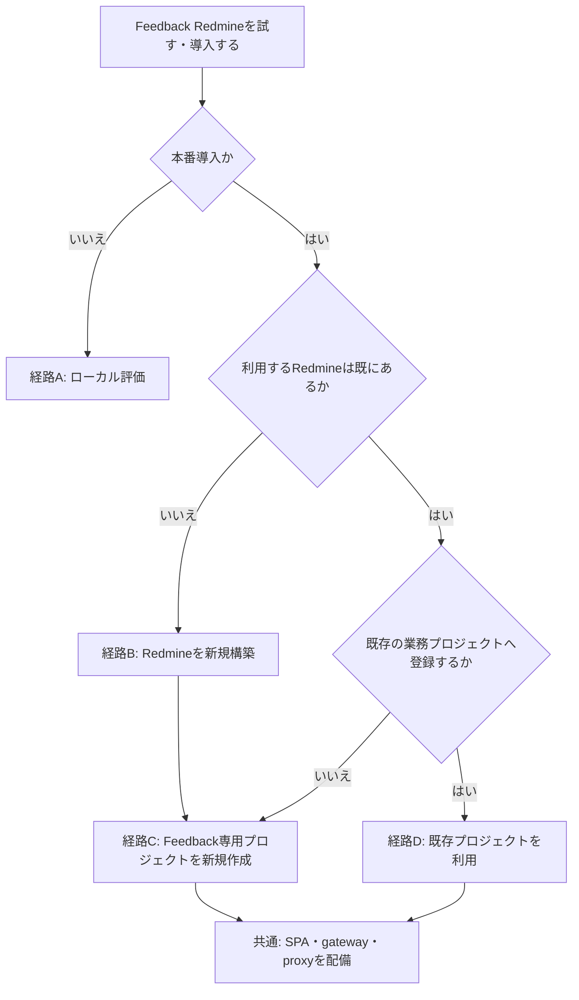

# Feedback Redmine導入・運用ガイド

この文書は、利用を開始する時点の状態から必要な手順を選ぶためのガイドである。最初に導入経路を決め、該当する節だけを実施する。
ローカル評価環境の自動構築と本番Redmineの変更は別の手順であり、本番環境でローカル用bootstrapを実行してはならない。

## 1. 最初に導入経路を選ぶ

ここでいう「Redmine」と「プロジェクト」は別の判断対象である。Redmineが既にあっても、Feedback専用プロジェクトを新しく作る場合と、
既存の業務プロジェクトへFeedbackチケットを登録する場合では手順が異なる。



フローチャートを表示できない環境では、次の表で選ぶ。

| 現在の状態 | 選ぶ経路 | Redmineへの変更方法 | 次に読む節 |
| --- | --- | --- | --- |
| まず手元で試したい | A: ローカル評価 | 専用Docker環境へ自動作成 | 3 |
| 本番用Redmine自体がまだない | B: Redmineを新規構築 | Redmineを組織標準で構築後、経路Cへ進む | 4、続いて5 |
| 既存Redmineはあるが、Feedback用プロジェクトは新しく分けたい | C: 専用プロジェクトを新規作成 | Rails provisioner、または管理画面＋inspect | 5 |
| 既存Redmineの既存業務プロジェクトへ登録したい | D: 既存プロジェクトを利用 | 管理画面＋二段階inspectだけ | 6、続いて7 |

本番では経路Cを推奨する。専用プロジェクトにすると、11個のcustom field、専用tracker、integration userの権限、workflowを
既存業務チケットから分離できる。

経路Dでは自動provisionerを使わない。自動provisionerはFeedback管理markerのない既存プロジェクトを競合として拒否し、apply時には
プロジェクトの説明、公開範囲、有効module、trackerをFeedback専用構成へ固定するため、既存業務プロジェクトの取り込みには適さない。

どの本番経路でも、Redmine側の準備が終わったら次の順に進む。

1. 8節でSPA、gateway、reverse proxyを配備する。
2. 9節のセキュリティ境界を確認する。
3. 10節の`doctor`とUX smoke testを実施する。

## 2. 共通の構成と前提条件

標準構成は、業務SPAへ組み込む`@geibee/feedback-redmine-plugin`、same-originのFeedback Redmine gateway、Redmineからなる。
thread、返信、状態、添付ファイル、custom fieldの唯一の正本はRedmineであり、Feedback専用DBやobject storageは使用しない。

検証対象は次のとおりである。

- Redmine 5.1.12、6.0.10、6.1.3、7.0.0
- React 18または19
- Node.js 22.12以上25未満
- Docker EngineとDocker Compose v2（ローカル評価およびOCI imageの検証時）
- Redmine REST APIを有効化できる管理権限
- 本番ではTLSを終端し、SPAとgatewayを同じoriginで公開できるreverse proxy
- Redmine DBと`files`を同じ時点で保存・復元できる運用権限

Redmine pluginはインストールしない。gatewayはRailsやRedmine DBへ直接接続せず、専用integration userのREST API keyだけを使う。

公開participant modeでは、同じoriginへ到達できる利用者が同じProfile内の投稿を閲覧・作成・返信できる。participant credentialは
自己編集の所有確認であり、実在人物の認証ではない。社内利用者等へ公開範囲を限定する場合はreverse proxyまたは上位gatewayで外部認証を必須にする。

次のいずれも利用できない既存Redmineには導入できない。

- Rails runnerを実行できる。
- 管理画面でproject、tracker、custom field、role、user、workflowを変更でき、administrator REST APIでinspectできる。

## 3. 経路A: 手元でローカル評価する

この経路は製品評価と開発だけに使用する。Redmine 7.0.0とPostgreSQL 17.6のdigest固定imageを起動し、本番Redmineは変更しない。

source checkoutでは次のcommandで、必要なpackageとgateway/demo imageをbuildし、PostgreSQL、Redmine、provisioner、gateway、デモSPAを起動する。

```bash
npm ci
npm run feedback:redmine:local
```

配布済みreleaseを使う場合は、承認済みregistryとOCI registryへ同じversionのartifactを公開したうえで次を実行する。

```bash
npx @geibee/feedback-redmine-ops@<version> local up
```

既定のデモは`http://127.0.0.1:4173`、Redmine管理画面は`http://127.0.0.1:3001`である。別portは
`--demo-port 14173 --redmine-port 13001`で指定できる。全portはloopbackだけへbindする。

初回起動時に`.feedback-redmine`へ次を生成する。

- 推測不能なDB password、Redmine secret key base、participant署名鍵
- 専用project、tracker、2 status、priority、最小権限role、integration user、11 custom fields
- 実際の数値IDを持つclient/server profileと公開runtime config
- integration API keyとランダム化したRedmine管理者password

secretとprofileを含むstate directoryは0700、secret fileは0600で作成する。管理者資格情報に既定値はない。

管理者案内は`.feedback-redmine/public/feedback-redmine.json`の`submissionNotice`を編集し、デモSPAを再読み込みすると反映される。
この`public` directoryだけをdemo containerへread-only mountするため、同じstate directoryにあるsecretは公開されない。SPAやcontainerの
rebuild・restartは不要である。Viteでdemoを直接起動している場合は
`apps/feedback-redmine-demo/public/.well-known/feedback-redmine.json`を編集する。`local reset --yes`は公開設定も削除する。

```bash
node packages/feedback-redmine-ops/dist/cli.js local credentials
node packages/feedback-redmine-ops/dist/cli.js local status
node packages/feedback-redmine-ops/dist/cli.js local logs
node packages/feedback-redmine-ops/dist/cli.js local down
```

release版では先頭を`npx @geibee/feedback-redmine-ops@<version>`へ置き換える。状態を別directoryに置く場合は全commandへ
`--state-dir /absolute/path`を付ける。

ローカルデータを消す場合だけ次を実行する。対象state directoryから導出した専用Compose projectのvolumeを削除するため、本番や既存Redmineには使用しない。

```bash
feedback-redmine local reset --yes
```

ローカル評価だけが目的なら、この後は10節のUX smoke testへ進む。本番導入ではこの環境を流用せず、経路B、C、Dのいずれかを選び直す。

## 4. 経路B: 本番用Redmineを新規に構築する

このリポジトリは本番用Redmine本体、DB、添付ファイルstorageを構築しない。Redmine公式手順と組織の標準基盤に従い、次を先に用意する。

1. 2節に記載した対応versionのRedmineと、そのversionが対応するDBを構築する。
2. TLSでRedmineを公開し、gatewayからだけ到達できるnetwork経路を用意する。
3. REST APIを有効化できる管理者と、Rails runnerまたは管理画面＋administrator REST APIの作業経路を用意する。
4. Redmine DBと`files`を同じ時点でbackup・restoreできることを確認する。
5. Redmine自体の初期管理者password、mail、job、監視等を組織標準に従って設定する。

Redmineの準備が終わった時点ではFeedback設定はまだ存在しない。続けて経路Cへ進み、Feedback専用プロジェクトを作成する。
ローカル評価用Composeや`--local-evaluation`を本番Redmineへ使用しない。

## 5. 経路C: RedmineにFeedback専用プロジェクトを新規作成する

この経路では既存の業務プロジェクトを変更せず、Feedback専用project、tracker、role、integration user、custom fieldを作る。
まず[`examples/feedback-redmine-installation.json`](examples/feedback-redmine-installation.json)を安全な作業directoryへコピーし、次を編集する。

- `redmineBaseUrl`: 対象RedmineのHTTPS URL
- `project.identifier`と`project.name`: 存在しないFeedback専用プロジェクトの識別子と名前
- `trackerName`、`roleName`、`integrationUser`: 既存業務設定と衝突しない専用名称
- `profileId`、`applicationKey`、`environmentKey`、`externalWorkspaceKey`: SPAの利用範囲
- `isPrivate`: 作成するFeedbackチケットをprivate issueにするか
- `captureEnabled`: 画面キャプチャを保存するか
- `showRedmineLink`: Feedback UIからRedmineへ直接遷移させるか

manifestは名前ベースであり、数値ID、API key、password、署名鍵を記載しない。レビュー観点は任意の`perspectives`へ
1〜100件の`{"code":"security","label":"セキュリティ"}`を指定する。`code`の追加・label変更・配列からの削除が、選択肢の追加・名称変更・削除に対応する。
省略時は`general`（一般）を生成する。

次に変更経路を選ぶ。

| 利用可能な権限 | 実施する手順 |
| --- | --- |
| Redmine applicationと同じRails runnerを実行できる | 5.1の自動plan/applyを使用する |
| Rails runnerはないが管理画面とadministrator REST APIを利用できる | 7節で手動設定し、7.3の二段階inspectを行う |
| どちらも利用できない | 導入できない。Redmine管理者へ作業を依頼する |

### 5.1 Rails runnerで専用プロジェクトを自動作成する

provisionerを配布artifactから抽出する。

```bash
feedback-redmine provision extract --output /secure/feedback-redmine/provision.rb
```

Redmine applicationと同じversionのRails実行環境へ`provision.rb`とmanifestをread-onlyで配置し、書込可能かつ非公開の出力directoryを用意する。
最初は必ず`plan`だけを実行する。

```bash
RAILS_ENV=production bundle exec rails runner \
  /secure/feedback-redmine/provision.rb plan \
  /secure/feedback-redmine/installation.json \
  /secure/feedback-redmine/output
```

`provision-plan.json`の`operations`、`conflicts`、Redmine version、`planDigest`を別の担当者も確認する。`conflicts`が1件でもある場合は
applyできない。既存設定を自動上書きせず、manifestの専用名称を変更してplanをやり直す。

承認した同じdigestだけをapplyへ渡す。

```bash
RAILS_ENV=production bundle exec rails runner \
  /secure/feedback-redmine/provision.rb apply \
  /secure/feedback-redmine/installation.json \
  /secure/feedback-redmine/output \
  <reviewed-planDigest>
```

applyはREST APIを有効化し、必要な設定を作成する。厳密一致するstatus、priority等がある場合だけ再利用する。出力される
`client-profile.json`、`server-profile.json`、`runtime-config.json`、`provision-result.json`には環境固有の実IDが入る。
`redmine-api-key`は唯一のsecret出力であり、secret managerへ移したら作業directoryから安全に削除する。

以上でRedmine側の準備は完了である。7節の手動作業とinspectは不要で、8節へ進む。

`--local-evaluation`はproject identifierが`feedback-local`の場合だけ使えるローカル専用optionである。本番Redmineで指定してはならない。
旧`infra/redmine/bootstrap.rb`や固定ID前提のbootstrapも本番Redmineでは実行しない。

## 6. 経路D: 既存Redmineの既存プロジェクトへ登録する

この経路では自動provisionerを実行しない。既存プロジェクトをそのまま保ち、Feedback専用設定だけを管理画面から追加して、read-only inspectで確認する。

### 6.1 既存プロジェクトに与える影響を確認する

Feedback gatewayが作成するチケットのprojectとtrackerはprofileで固定され、投稿者は選択できない。既存プロジェクトを使う場合も、
通常の業務チケットと分離するため、新しいFeedback専用tracker、専用integration role、専用integration userを作ることを強く推奨する。

変更前に次をRedmine管理者と合意する。

- 既存プロジェクトにFeedback専用trackerを追加してよい。
- 11個のFeedback custom fieldを、対象project、Feedback tracker、integration roleだけへ割り当ててよい。
- integration userを対象projectのmemberとして専用roleで追加してよい。
- Feedback trackerとintegration roleの組に4つのworkflow遷移を設定してよい。
- Feedbackチケットをprivate issueにするか、既存プロジェクト参加者からも見えるようにするか。
- Redmineへの直接リンクをFeedback UIに表示する場合、利用者が対象プロジェクトを閲覧できる。

この変更を許容できない場合は、経路Cの専用プロジェクト、または別Redmine instanceを選ぶ。

### 6.2 既存プロジェクト用manifestを作る

サンプルmanifestをコピーし、`project.identifier`と`project.name`を既存プロジェクトの正確な値にする。`trackerName`、`roleName`、
`integrationUser`には、原則として新しく作るFeedback専用設定の名称を指定する。通常利用者のroleや個人API keyを流用しない。

同名の`Feedback ...` custom fieldが既にある場合は、7.1の形式、filter、対象project、tracker、roleが完全一致するか確認する。一致しないfieldを
既存用途へ影響する形で変更してはならない。現在のinspectはcustom field名をmanifestで変更できないため、安全に一致させられない場合はこの経路を中止し、
Redmine管理者と専用Redmine instance等の分離方法を決める。

manifestを作成したら7節を順に実施する。最初のinspectが終了code 2になること、手動checklistを確認した二回目だけprofileを生成することが正常な流れである。

## 7. 管理画面で手動設定し、inspectする

この節は次の利用者だけが実施する。

- 経路CでRails runnerを利用できない場合
- 経路Dで既存プロジェクトを利用する場合

### 7.1 project、tracker、custom fieldを設定する

経路Cではmanifestに指定した新規専用projectを作る。経路Dでは既存projectの名前、説明、公開範囲、既存moduleを変更せず、
Feedback専用trackerだけを追加する。RedmineのREST APIを有効化し、manifestの`defaultPriorityName`と同名のactive priorityを作成または選択する。

11個のfieldはすべて「チケット」のカスタムフィールドとして作成し、対象project、Feedback tracker、integration roleだけへ割り当てる。
「全プロジェクト向け」は無効にする。表のfilterが「有効」のfieldだけフィルタおよび検索を有効にする。

| server profile key | 正確な名称 | Redmine形式 | filter | 用途 |
| --- | --- | --- | --- | --- |
| `threadId` | Feedback Thread ID | テキスト（1行） | 有効 | thread検索と冪等回収 |
| `requestHash` | Feedback Request Hash | テキスト（1行） | 無効 | retry内容の一致確認 |
| `applicationKey` | Feedback Application | テキスト（1行） | 有効 | application scope |
| `environmentKey` | Feedback Environment | テキスト（1行） | 有効 | environment scope |
| `externalWorkspaceKey` | Feedback Workspace | テキスト（1行） | 有効 | workspace scope |
| `pageKey` | Feedback Page | テキスト（1行） | 有効 | 画面別一覧と遷移 |
| `hostResourceKey` | Feedback Host Resource | テキスト（1行） | 有効 | resource境界と詳細取得 |
| `perspectiveCode` | Feedback Perspective | テキスト（1行） | 有効 | 観点filter |
| `locator` | Feedback Locator | 長いテキスト | 無効 | target/locationのcompact JSON |
| `submittedById` | Feedback Submitted By ID | テキスト（1行） | 無効 | participant ID |
| `submittedByName` | Feedback Submitted By Name | テキスト（1行） | 無効 | 自己申告表示名 |

### 7.2 role、user、status、workflowを設定する

integration userは専用の通常userとし、administratorにしない。他projectのmemberにも追加しない。roleのissue visibilityは「すべてのチケット」、
権限は次だけにする。

- チケットの閲覧（`view_issues`）
- チケットの追加（`add_issues`）
- チケットの編集（`edit_issues`）
- 注記の追加（`add_issue_notes`）
- 非公開注記の閲覧（`view_private_notes`）
- private issueを使う場合だけチケットを非公開に設定（`set_issues_private`）
- 親チケット入力を有効にする場合だけサブタスクの管理（`manage_subtasks`）

open statusとclosed statusを各1つ決め、Feedback trackerの既定statusをopenへ設定する。integration roleのworkflowには
open→open、open→closed、closed→open、closed→closedの4遷移を設定する。既存業務trackerとroleのworkflowは変更しない。

integration userを対象projectのmemberとして専用roleで追加し、API keyを一度だけ取得してsecret managerへ保存する。server profileの`secretRef`は
secretの論理名だけを持ち、API keyそのものをprofile、SPA、runtime config、image、Gitへ書かない。

### 7.3 read-only inspectを二段階で実行する

数値IDはRedmine環境固有である。推測したIDや別環境のIDをserver profileへコピーせず、administrator API keyを一時的に環境変数へ入れて
read-only inspectからprofileを生成する。API keyをcommand引数、manifest、inspection、checklist、profileへ保存してはならない。

一回目はREST検査結果、手動checklist、現在の`manualCheckDigest`を取得する。この時点では手動項目が未承認なので終了code 2が正常であり、profileは生成されない。

```bash
export FEEDBACK_REDMINE_INSPECT_API_KEY='<temporary-admin-api-key>'
feedback-redmine inspect \
  --manifest /secure/feedback-redmine/installation.json \
  --manual-checklist /secure/feedback-redmine/manual-checklist.md \
  --output /secure/feedback-redmine/inspection.json
unset FEEDBACK_REDMINE_INSPECT_API_KEY
```

inspectは`/users/current.json`、project、tracker、status、priority、custom field、role、user、membershipをGETするだけで、Redmineを変更しない。
`inspection.json`のREST `checks`に`missing`または`mismatch`がある場合は、Redmine管理画面で設定を修正し、一回目からやり直す。

出力されたMarkdown checklistに従い、RESTだけでは確認できない次の15項目を管理画面で確認する。

- 11 custom fieldsそれぞれのfilter・検索設定、対象project/tracker/roleだけへの割当、「全プロジェクト向け」の無効化
- Feedback tracker・integration roleに対するopen→open、open→closed、closed→open、closed→closedの4 workflow遷移

全項目を確認したら、`inspection.json`の`manualCheckDigest`をそのまま指定し、存在しない新規`generated-dir`へprofileを生成する。

```bash
export FEEDBACK_REDMINE_INSPECT_API_KEY='<temporary-admin-api-key>'
feedback-redmine inspect \
  --manifest /secure/feedback-redmine/installation.json \
  --accept-manual-checks <manualCheckDigest> \
  --generated-dir /secure/feedback-redmine/generated-20260821 \
  --output /secure/feedback-redmine/inspection-accepted.json
unset FEEDBACK_REDMINE_INSPECT_API_KEY
```

終了codeは、REST不足・不一致または手動項目未承認が2、staleまたは異なるdigestが1、REST検査成功かつ現在のdigestを承認した場合が0である。
終了code 0の場合だけ`client-profile.json`、`server-profile.json`、`runtime-config.json`を生成する。設定またはmanifestを変更した場合は以前のdigestを
再利用せず、一回目からやり直す。

以上でRedmine側の準備は完了である。8節へ進む。

## 8. 共通: SPA、gateway、reverse proxyを配備する

### 8.1 配備時runtime config

SPAは`/.well-known/feedback-redmine.json`を`Cache-Control: no-store`、`Content-Type: application/json`で同一originから配信する。

```json
{
  "schemaVersion": "1",
  "enabled": true,
  "profileId": "inventory-production",
  "gatewayBasePath": "/internal/feedback-redmine/v1",
  "submissionNotice": {
    "message": "動画などのファイルはSharePointへ配置し、URLをコメントで共有してください。",
    "link": {
      "url": "https://sharepoint.example.test/feedback",
      "label": "ファイル配置先を開く"
    }
  }
}
```

このファイルは公開情報だけで、Redmine URL、数値ID、API key、participant署名鍵を含めない。配備時に`enabled`を変更できるため、
Feedbackの有効・無効だけならSPAを再buildせず、runtime configの配備と次回ページロードで切り替えられる。不正な設定、取得失敗、unknown fieldはfail-closedでUIをmountしない。
`submissionNotice`は任意で、messageはplain text 1〜2000文字、linkはuserinfoを含まないHTTPS URLと1〜200文字のlabelだけを許可する。
runtime loader利用時はこのファイルを唯一の案内設定源とし、呼出しoptionからの上書きは受けない。Blob Storage、S3、CDNまたはreverse proxyで
SPAと同じoriginの固定pathへ配置するのが標準であり、変更は次回ページロードで反映される。独自CMSやFeedback DBは必要ない。

```ts
import { useEffect } from "react";
import { createRedmineFeedbackPluginControllerFromRuntimeConfig } from "@geibee/feedback-redmine-plugin/loader";
import type { RedmineFeedbackPluginController } from "@geibee/feedback-redmine-plugin/loader";

export function FeedbackIntegration(): null {
  useEffect(() => {
    const abort = new AbortController();
    let feedback: RedmineFeedbackPluginController | null = null;
    void createRedmineFeedbackPluginControllerFromRuntimeConfig({
      adapter,
      contextMenu: true,
      targetResolver,
      pinPositionProvider,
      signal: abort.signal,
      onUnavailable: (error) => console.error("Feedbackを利用できません", error)
    }).then((created) => {
      if (abort.signal.aborted) created?.destroy();
      else feedback = created;
    });
    return () => {
      abort.abort();
      feedback?.destroy();
    };
  }, []);
  return null;
}
```

取得は既定5秒でtimeoutする。React cleanupで`signal`を中止し、StrictMode、route遷移、microfrontend破棄後の遅延mountを防ぐ。
origin rootへ配置できない場合は`configPath: "/inventory/.well-known/feedback-redmine.json"`のように同一originの
root-relative pathを指定する。SSR frameworkではこのcomponentをclient-only境界へ置く。

既存consumerの`VITE_FEEDBACK_REDMINE_ENABLED`はViteのbuild時置換であり、値を変えるだけでは配備済みSPAへ反映されない。
次回upgradeで上記runtime loaderへ移行する。package versionやintegration codeを変更した場合は従来どおりSPAの再buildが必要である。

### 8.2 標準gateway

releaseに含まれる`feedback-redmine-gateway` OCI imageへ次を設定する。

| 変数 | 必須 | 内容 |
| --- | --- | --- |
| `FEEDBACK_PUBLIC_ORIGIN` | 必須 | 利用者が開くSPAの正確なorigin。例: `https://inventory.example.test` |
| `FEEDBACK_REDMINE_GATEWAY_PROFILE_FILE` | 必須 | read-onlyの`server-profile.json` absolute path |
| `FEEDBACK_REDMINE_GATEWAY_API_KEY`または`_FILE` | どちらか必須secret | 専用integration userのAPI keyまたはsecret fileのabsolute path |
| `FEEDBACK_PARTICIPANT_SIGNING_KEY` | 必須secret | 32 bytes以上のランダム値 |
| `FEEDBACK_REDMINE_OPTIONAL_ISSUE_FIELDS` | 任意 | `parent_issue,due_date,priority`から表示する項目。未設定は全項目無効 |
| `PORT` | 任意 | listen port。既定8080 |

本番で`NODE_ENV=development`を設定しない。本番profileのRedmine URLと`FEEDBACK_PUBLIC_ORIGIN`はHTTPSを必須とする。
gatewayはHost headerやrequest Originから公開originを推測せず、`FEEDBACK_PUBLIC_ORIGIN`との完全一致で検証する。

起動順は次のとおりである。

1. Redmine DBと添付ファイルvolumeを復元または起動する。
2. Redmineを起動し、REST APIと専用projectを確認する。
3. profileとsecretをread-only mountしてgatewayを起動する。
4. `/internal/feedback-redmine/v1/health/ready`が200になった後にreverse proxyへ組み込む。
5. runtime configとSPAを配備し、`doctor`を実行する。

gateway containerはnon-root、read-only root filesystem、`cap_drop: ALL`、`no-new-privileges`、容量制限付き`/tmp`で動かす。
`health/live`と`health/ready`はprocessと起動時設定のhealthであり、Redmineまでの疎通は`doctor`で確認する。

projectとtrackerはinstallation manifestで固定し、投稿者には選択させない。任意項目を有効にすると、そのprofileを利用する全員が投稿画面で選択できる。
親チケットは同じ固定projectに存在するpositive IDだけ、期限は実在する`YYYY-MM-DD`、重要度はRedmineのactive priorityだけを受ける。
省略時のpriorityは従来どおりserver profileの`defaultPriorityId`を使う。Gatewayは無効な項目を直接送るrequestも拒否し、選択値をrequest hashと
context attachmentへ含めてretry内容の不一致を検出する。

Thread詳細の「Redmineの変更履歴」は既定で折りたたむ。表示対象はstatus、assignee、priority、tracker、subject、description、attachmentの
journal変更と診断行である。Redmineのcopy操作や子チケット作成そのものは表示せず、その操作が上記fieldを変更した場合だけ該当変更として表示する。
動画や任意ファイルをFeedback UIからuploadする機能は提供せず、管理者案内で指定した保管先URLをコメントとして共有する。

### 8.3 reverse proxy

[`deploy/feedback-redmine/nginx-location.conf.example`](../deploy/feedback-redmine/nginx-location.conf.example)を、TLSを終端する業務SPAの
server blockへ組み込む。gatewayの8080をインターネットや利用者networkへ直接公開しない。

- `/internal/feedback-redmine/v1/`だけをgatewayへproxyする。
- `Origin`と`Sec-Fetch-*`を削除・書換えしない。
- request body、cookie、API key、participant credentialをaccess/error logへ記録しない。
- screenshot上限を考慮して`client_max_body_size`をprofile上限より少し大きくする。
- CSPの`img-src`で`'self' data: blob:`を許可する。外部scriptは許可しない。
- 外部認証を使う場合はSPAとgateway pathの双方へ同じ認証境界を適用する。

## 9. 共通: セキュリティ境界を確認する

通信経路は利用者→TLS reverse proxy→SPA/gateway、gateway→TLS Redmineだけにする。Redmineを利用者へ公開する必要はなく、
firewallまたはNetworkPolicyでgatewayからRedmine HTTPSへの接続だけを許可する。gatewayはstatelessなのでDB、volume、object storageへ接続させない。

gatewayのOrigin/Fetch Metadata検証はCSRF緩和であり認証ではない。公開範囲を制限する配備では、OIDC-aware proxy、VPN、mTLS等の
既存アクセス制御を外側へ置く。proxyが認証headerを付けても、現在の公開participant modeはその値を本文やRedmineの本人確認情報として使わない。
`submittedByName`は自己申告表示名である。

secretの扱いは次に固定する。

- Redmine API keyとparticipant署名鍵に既定値を設けない。
- orchestratorのsecret、read-only secret file、またはsecret managerから注入する。
- SPA、HTML、runtime config、client/server profile、container image、Git、log、metric、problem responseへ埋め込まない。
- API keyは専用integration userだけに紐付け、退職者等の個人keyを使わない。
- API keyを更新するときはRedmine側で旧keyを失効して新keyをsecret managerへ登録し、gatewayをrolling restartしてから旧podが消えたことを確認する。
- participant署名鍵の変更は全browser credentialを失効させ、過去投稿の自己編集確認にも影響する。現在は旧鍵keyringを持たないため、通常更新せず、漏えい時のincident対応として利用者へ影響を告知して変更する。

private issueを使う場合も、Redmineのproject membershipとroleを最小にする。`showRedmineLink=true`は利用者がRedmineへ到達でき、
かつチケット表示が許可される環境だけで有効にする。

## 10. 共通: 動作確認する

通常の疎通確認はRedmine issueを作らない。

```bash
feedback-redmine doctor \
  --origin https://inventory.example.test \
  --profile inventory-production \
  --output doctor.json
```

このcommandはgateway ready、profile、participant credential発行、integration userによるRedmine current user取得を確認する。
検証用issueを作る場合だけ明示的に`--write-canary`を付ける。作成されたthread IDを出力するので、確認後は組織のルールに従い
Redmineで終了または削除する。

```bash
feedback-redmine doctor \
  --origin https://inventory.example.test \
  --profile inventory-production \
  --write-canary
```

stagingでは次のUX smoke testも行う。

1. launcherから対象選択し、選択箇所のpinと独立composerが表示される。
2. `contextMenu: true`で対象を右クリックし、同じcomposerを開ける。
3. composerと詳細drawerをそれぞれ閉じ、再度開ける。
4. 投稿時のpreviewとRedmine attachmentにscreenshotがあり、feedback箇所のpinが画像へ焼き込まれている。
5. 詳細drawerでattachment画像を表示・downloadできる。
6. `他の人の投稿を見る`で同じProfileのWorkspace投稿が表示され、別画面の項目からHostの`navigate`後にthreadを開ける。
7. Feedback UIから返信と自己編集ができ、Redmine journalへ追記される。
8. Redmineからの返信、担当、優先度、状態変更が次回pollでUIへ反映される。
9. runtime configを`enabled:false`にしてページをreloadするとUIをmountせず、`true`へ戻してreloadすると再mountする。

Profileはapplication、environment、external workspaceの組を固定する。`applicationKey`は製品、`environmentKey`は本番／staging等、
`externalWorkspaceKey`は閲覧共有範囲を分ける。`pageKey`は画面、`hostResourceKey`はレコード等の詳細取得境界である。
「他の人の投稿を見る」は同じProfileのWorkspace全体を対象にするため、見せてはいけない集団は別Profileにする。

issue descriptionへ保存するのは初回コメントと、`feedbackThread` queryを持つsame-originの自動link URLだけである。Application、Environment、
Workspace、Page、Host resourceをdescriptionへ重複記載しない。一方、これらのcustom fieldは一覧のscope、API検索、冪等性、resource境界に使う
構造化索引なので、遷移用URLだけでは代替しない。Redmine UIでlinkを押すとSPAのadapterが対象画面へ遷移し、該当threadを開く。

screenshot取得は現在有効で、ローカルProfileも`capture.enabled=true`である。失敗時は画像なしで投稿できるが、CSP、cross-origin image、
WebGL canvas、upload上限を調べる。MapLibre固有の地物解決と地図pinは自動ではなく、`@geibee/feedback-maplibre`のtarget resolverと
pin position providerをHost Adapterへ指定した場合だけ有効になる。

## 11. upgradeとrollback

releaseはnpm tarball、linux/amd64・linux/arm64のgateway/demo OCI archive、CycloneDX SBOM、HIGH/CRITICAL vulnerability report、
release manifest、SHA-256を同じversionで生成する。修正版があるHIGH/CRITICALは生成を停止し、修正版がない項目もSARIFでreviewする。

```bash
bash scripts/build-feedback-redmine-release.sh \
  --output /secure/release/feedback-redmine-<version> \
  --version <version>
```

本番更新は次の順で行う。

1. release manifest、checksum、署名、SBOM、脆弱性reportを検証する。
2. Redmine DBと`files`の同時点backupを取得し、直近のrestore試験結果を確認する。
3. 新versionに同梱されたinstallation schemaとprovisionerを`plan`で実行する。競合があれば停止する。
4. stagingで新gateway、SPA package、runtime configを同じversionへ揃え、read-only doctor、write canary、UX smokeを通す。
5. 本番gatewayを先にrolling updateし、readyとread-only doctorを確認する。
6. package更新がある場合は新SPAを配備する。runtime configだけの切替なら再buildしない。
7. write canaryと主要UXを確認し、監視期間後に旧imageを保持期限まで保管する。

rollbackは、runtime configを`enabled:false`にして新規操作を止め、旧gateway imageと旧SPA artifactを同時versionへ戻す。
provisionerは既存fieldを削除せず、rollbackでもRedmine issue、journal、attachment、custom fieldを削除しない。Redmine設定や保存形式に
非互換変更が含まれるreleaseでは、そのrelease固有の互換性文書とrestore rehearsalがない限り本番へ進めない。

alpha間では公開契約が変わる可能性がある。OpenAPI、JSON Schema、生成型、`docs/api-compatibility.md`、各CHANGELOGを同じreleaseで確認する。

## 12. backup、restore、トラブルシューティング

### 12.1 本番backup

RedmineはDBだけでも`files`だけでも完全に復元できない。次を同じ停止窓または整合性のあるstorage snapshot時点で取得する。

1. reverse proxyでFeedbackのwriteを停止し、gatewayを停止する。
2. Redmine web、job、plugin等の書込processを停止する。DB serviceは起動したままにする。
3. PostgreSQLなら`pg_dump -Fc`等、利用DBの正式な論理backupまたは整合snapshotを取得する。
4. Redmineの`files` directoryまたは対応volumeを同じ時点でarchive/snapshotする。
5. Redmine version、DB engine/version、plugin一覧、設定、取得日時、両artifactのSHA-256をmanifestへ記録する。
6. Redmine、gateway、proxyを再開し、read-only doctorを実行する。

DBのPITRを使う場合は、`files` snapshotとの対応時刻を記録する。backupは暗号化し、API key等のsecret backupとは保管権限を分離する。

restoreは隔離環境で定期的にrehearsalする。対象Redmineとgatewayを停止し、空DBへrestoreして`files`を同じ世代から戻す。
Redmine migrationを対象versionの正式手順で適用した後、添付ファイルの取得、thread一覧、返信、自己編集を確認する。本番restore時も
異なる世代のDBと`files`を混ぜず、復元前の破損状態を別backupとして保全する。

### 12.2 ローカルbackupとrestore

ローカルCLIはRedmine、gateway、demoを停止してからDBとfilesを保存し、checksum付きmanifestと復元に必要なローカルsecret/profileを
0600で保存して再起動する。

```bash
feedback-redmine local backup --output /secure/backups/feedback-local-20260820
feedback-redmine local restore --input /secure/backups/feedback-local-20260820 --yes
```

backup directoryにはsecretが含まれるため、0700相当の親directoryで暗号化保管する。restoreは専用Compose volumeを作り直す破壊的操作である。

### 12.3 障害調査

| 症状 | 確認事項 |
| --- | --- |
| runtime config取得失敗 | path、200、`application/json`、`no-store`、schemaVersion、unknown field、same-origin |
| `origin_not_allowed`相当 | `FEEDBACK_PUBLIC_ORIGIN`とbrowserのscheme/host/port完全一致、proxyがOriginを保持しているか |
| GETだけ拒否 | browserの`Sec-Fetch-Site: same-origin`、proxy／WAFによるheader削除 |
| participant発行失敗 | 署名鍵が32 bytes以上、全podで同一、secretの改行や誤mount |
| Redmine 401 | integration userのAPI key失効、別user key、secretRefと注入名の不一致 |
| Redmine 403 | project membership、最小権限role、private issue、workflow |
| profileを生成できない | inspect JSONのmissing/mismatch、11 fieldの名称・形式・実ID、project/tracker/role割当 |
| 投稿一覧が空 | profile/application/environment/workspace/page/resourceの不一致、別Profileを見ていないか |
| 「他の人の投稿を見る」が不足 | 同じProfileか、workspace scope requestか、Host Adapterのnavigateが完了しているか |
| screenshotがない | `capture.enabled`、CSP `img-src data: blob:`、cross-origin画像、canvas、upload size |
| 地図上のpin/地物がずれる | MapLibre resolver/providerの接続、feature key、map移動後のposition再計算 |
| 詳細画像だけ出ない | Redmine attachment、content type/size、gateway attachment path、Redmine base path |
| restore後に自己編集できない | participant署名鍵を同じ世代から復元したか。localStorage削除や鍵変更後は回復不可 |

調査は`local status`、`local logs`、gateway health、`inspect`、read-only `doctor`の順に行い、write canaryは最後に明示実行する。
access logやsupport bundleへcookie、API key、participant credential、request body、screenshotを含めない。API key更新後は旧keyの失効、
全gateway instanceの再起動、doctorまでを一つの変更作業として記録する。
